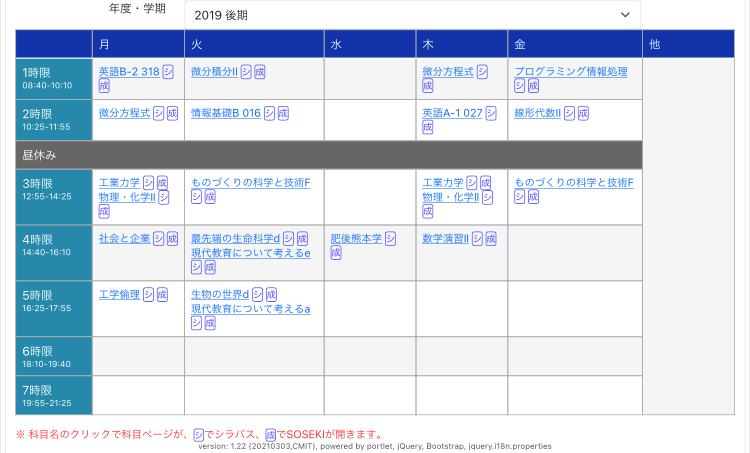
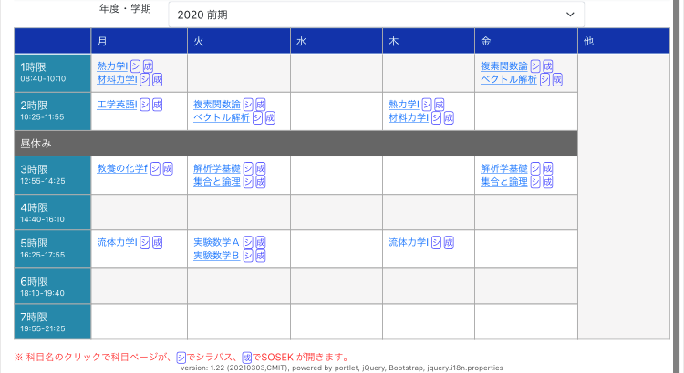
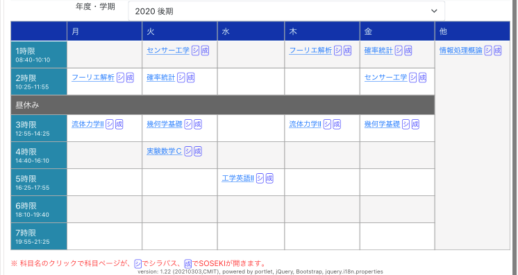

投稿日：2021/09/20

# 熊大の数理工を紹介する話

## はじめに

こんにちは．[Fumiyan](https://fumiyanll23.github.io/)です．
今回は私が所属している数理工学教育プログラム (旧・数理工学科) を紹介したいと思います．

YouTubeにいくつか紹介動画がアップされているので，まずはそちらをご覧ください

- [学部，学科，教育プログラムおよび研究室の紹介](https://www.youtube.com/watch?v=f2Jc-coXpVM&list=PLGr7stfmmGK7Ey-t3BFDSusb6HhMTOkfB&index=11)
  - 前半は工学部機械数理工学科数理工学教育プログラムの紹介です
  - 後半は私が所属している研究室の紹介です
- [研究内容の一例](https://www.youtube.com/watch?v=WUMJwg6WhRI&list=PLGr7stfmmGK7Ey-t3BFDSusb6HhMTOkfB&index=7)
  - データを安全に保管する技術である「秘密分散法」の紹介です
  - [動画内に登場したWebアプリケーションのURL](https://shiromol301.github.io/ssss-demo/sharing)

## FAQ

※以下は「はじめに」で紹介した動画を視聴していることを前提に書いてあります

### Q. 工学部の他学科と比較した数理工学教育プログラムの魅力は何ですか?

工学部の他学科の科目も履修できることです．私は

- 情報工学 (オペレーティングシステムやネットワーク，プログラミングなど)
- 機械工学 (熱力学や流体力学，数値解析など)

に興味を持ったので，それらに関係する科目を履修しました．

### Q. どのような科目を履修しますか?

[こちら](https://www.eng.kumamoto-u.ac.jp/department/dept2/dept2-2/#anchor3)に掲載されています．

一般に，大学で開講されている講義は

- 開講時期 (前期 or 後期，曜日，時限)
- 取得単位数
- 学習する内容や講義の回数
- 成績のつけ方 (テストやレポートの有無とそれらの配点)
- 参考文献

などの情報 (シラバス) が公開されています．興味を持った講義は自分で調べてみましょう．
熊本大学のシラバスは[こちら](http://syllabus.kumamoto-u.ac.jp/index.html?locale=ja)です．

### Q. 人数が少ないと聞きました

学年あたり約20人という少人数のプログラムです．
そのため，学年を問わず学生同士の仲が良いです．
また，先生方との距離が近いので気軽に質問や相談ができます．

### Q. 卒業後の進路はどのようなものがありますか?

機械数理工学科の卒業後の進路は[こちら](https://www.eng.kumamoto-u.ac.jp/department/dept2/dept2-4/)に掲載されています．
また，数理工学教育プログラムの卒業後の進路は[こちら](https://srik.kumamoto-u.ac.jp/course)に掲載されています (動画内のものとほとんど同じです)．

### Q. 具体的な時間割を教えてください

画像はある学生が学部1，2年生のときに組んだ実際の時間割です．

- 学部1年生
  - 前期
  
  - 後期
  
- 学部2年生
  - 前期
  
  - 後期
  

## おわりに

質問がありましたら[メール](mailto:fumiyanll23.public@gmail.com)や[Twitter](https://twitter.com/fumiyanll23/)のDMで連絡をください．

## 関連するリンク

- [熊本大学](https://www.kumamoto-u.ac.jp/)
- [工学部機械数理工学科](https://www.eng.kumamoto-u.ac.jp/department/dept2/)
- [数理工学教育プログラム](https://srik.kumamoto-u.ac.jp/)
- [熊本大学WEBオープンキャンパス2021](https://www.kumamoto-u.ac.jp/opencampus/)
